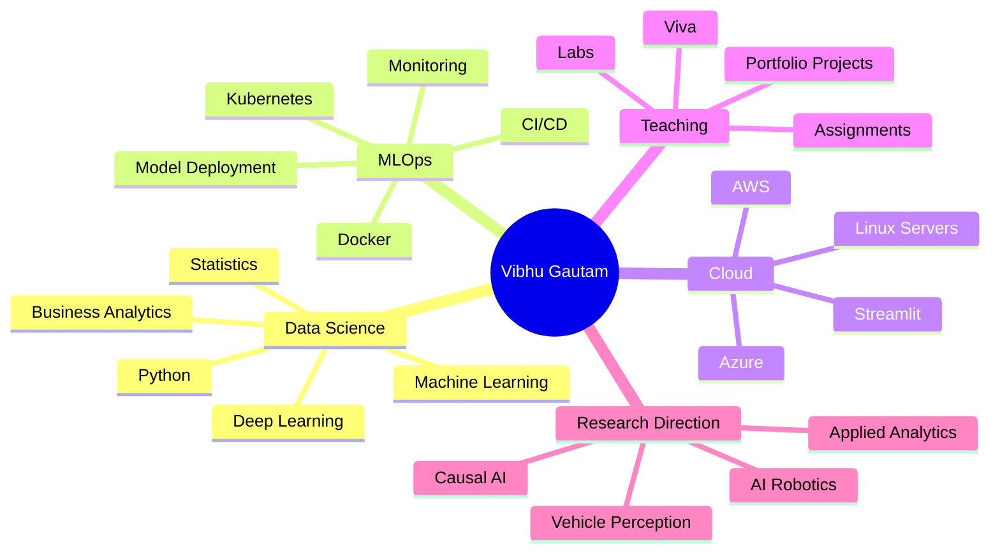

<!--
Profile README for: vibhug0077
Repo: https://github.com/vibhug0077/vibhug0077
-->

---

## 👋 About Me

I am **Vibhu Gautam**, a **Professor of Practice in Computer Science** focused on building practical, industry-aligned learning experiences in:

- **Data Science, Machine Learning, Deep Learning and Business Analytics**
- **DevOps, MLOps, Docker, Kubernetes and Cloud Model Deployment**
- **Python programming, Linux labs, automation and applied AI systems**
- **Project-based teaching, hands-on labs and portfolio-ready student work**

My GitHub is a growing collection of teaching repositories, practical labs, technical notes, notebooks, automation scripts and learning resources.

---

## 🚀 Current Mission

<table>
<tr>
<td width="33%" valign="top">

### 🧠 Applied AI
Building learning resources around classical ML, deep learning, perception, analytics and model deployment.

</td>
<td width="33%" valign="top">

### ⚙️ MLOps + Cloud
Creating practical labs around Docker, Kubernetes, Linux, Streamlit, CI/CD and cloud deployment workflows.

</td>
<td width="33%" valign="top">

### 📚 Teaching Repositories
Designing clean, structured repositories that students can use for labs, viva, assignments and portfolio development.

</td>
</tr>
</table>

---

## 🧰 Tech Stack

### Languages & Analytics

### Machine Learning & AI

### DevOps, MLOps & Cloud

---

## 🗂️ Featured Repositories

---

## 📌 Repository Map

| Area | Repositories | What You Will Find |
|---|---|---|
| **Python + Programming** | [`Python_Programing`](https://github.com/vibhug0077/Python_Programing), [`DSA_Python_Easy_21Day`](https://github.com/vibhug0077/DSA_Python_Easy_21Day) | Python notebooks, programming practice, DSA foundations |
| **Machine Learning** | [`Classical_Machine_Learning_First_Course`](https://github.com/vibhug0077/Classical_Machine_Learning_First_Course), [`Mathematics-for-Machine-Learning`](https://github.com/vibhug0077/Mathematics-for-Machine-Learning) | ML concepts, math foundations, notebooks and examples |
| **Linux + Automation** | [`Linux_Lab`](https://github.com/vibhug0077/Linux_Lab) | Linux commands, shell scripting, lab practice and automation |
| **DevOps + Containers** | [`Docker_Containers`](https://github.com/vibhug0077/Docker_Containers) | Docker labs, containers, orchestration foundations |
| **Cloud + Portfolio** | [`Cloud_Computing_Book`](https://github.com/vibhug0077/Cloud_Computing_Book), [`VibhuGautam`](https://github.com/vibhug0077/VibhuGautam) | Cloud notes, web portfolio and learning resources |

---

## 📊 GitHub Analytics

 

 

---

## 🧪 Teaching + Project Themes

---

## 🧭 Learning Philosophy

> **Teach by building. Learn by shipping. Improve by documenting.**

I believe students learn best when concepts are connected to real systems.  
That is why my repositories focus on:

- clean folder structure,
- practical lab execution,
- repeatable commands,
- readable scripts,
- viva-ready explanations,
- and portfolio-quality outcomes.

---

## 🔄 Dynamic Profile Section

<!--START:DYNAMIC_PROFILE-->
### Latest Profile Update

- **Last automated update:** 2026-07-06 09:00 IST
- **Current focus:** Data Science, Linux Labs, Docker, MLOps and Cloud Deployment
- **Active build mode:** Teaching repositories + practical project templates

### Recently Highlighted Repositories

| Repository | Focus |
|---|---|
| [`Python_Programing`](https://github.com/vibhug0077/Python_Programing) | Python notebooks and programming foundations |
| [`Linux_Lab`](https://github.com/vibhug0077/Linux_Lab) | Linux commands, Bash scripting and lab practice |
| [`Docker_Containers`](https://github.com/vibhug0077/Docker_Containers) | Docker, containers and DevOps labs |
<!--END:DYNAMIC_PROFILE-->

---

## 🤝 Connect With Me

---

### ⭐ Thanks for visiting my GitHub profile

