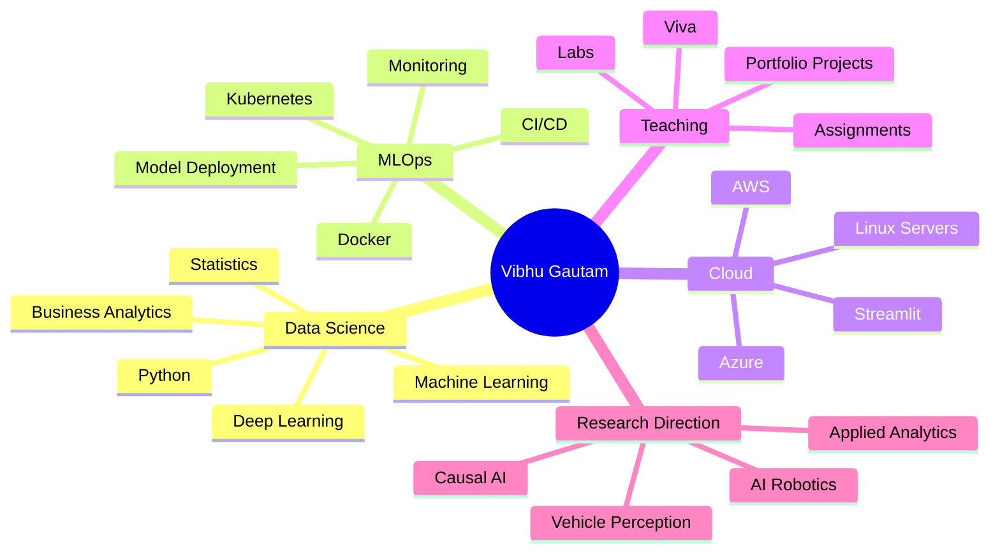

<!--
GitHub Profile README
Profile repository: vibhug0077/vibhug0077
Theme: Dark Navy Portfolio Theme
Portfolio reference: https://vibhug0077.github.io/vibhug0077/
-->

 

 

  

## PROFESSIONAL PROFILE

I am **Vibhu Gautam**, an **Experienced Data Scientist and Machine Learning Leader** and **Professor of Practice in Computer Science** with experience across industry and academia. My work connects **data science, applied AI, business analytics, cloud platforms, MLOps, Linux, Docker, Kubernetes and practical technical education**.

I build GitHub repositories that are designed to be useful for **students, labs, viva preparation, technical portfolios, applied AI projects and industry-style learning**.

---

## CORE FOCUS AREAS

<table>
<tr>
<td width="33%" valign="top">

### DATA SCIENCE

- Machine Learning
- Deep Learning
- Business Analytics
- Predictive Modeling
- Applied Machine Learning
- Applied AI Systems

</td>
<td width="33%" valign="top">

### MLOPS + CLOUD

- Docker
- Kubernetes
- Linux
- GitHub Actions
- Streamlit Deployment
- Cloud Model Deployment

</td>
<td width="33%" valign="top">

### TEACHING + LABS

- Python Programming
- Linux Lab
- Docker Labs
- Data Science Projects
- Viva Preparation
- Portfolio Projects

</td>
</tr>
</table>

---

## TECH STACK

### LANGUAGES & ANALYTICS

### MACHINE LEARNING & AI

### DEVOPS, MLOPS & CLOUD

---

## FEATURED REPOSITORIES

<table>
<tr>
<td width="50%" valign="top">

### 🐍 [Python Programming](https://github.com/vibhug0077/Python_Programing)

Python learning material, notebooks, programming fundamentals and practice examples.

</td>
<td width="50%" valign="top">

### 🐧 [Linux Lab](https://github.com/vibhug0077/Linux_Lab)

Linux commands, Bash scripting, permissions, automation and practical lab exercises.

</td>
</tr>

<tr>
<td width="50%" valign="top">

### 🐳 [Docker Containers](https://github.com/vibhug0077/Docker_Containers)

Docker labs, containerization examples, image creation, Compose and DevOps practice.

</td>
<td width="50%" valign="top">

### 📐 [Mathematics for Machine Learning](https://github.com/vibhug0077/Mathematics-for-Machine-Learning)

Mathematical foundations required for machine learning and data science.

</td>
</tr>

<tr>
<td width="50%" valign="top">

### 🤖 [Classical Machine Learning First Course](https://github.com/vibhug0077/Classical_Machine_Learning_First_Course)

Classical ML concepts, algorithms, examples and practical learning resources.

</td>
<td width="50%" valign="top">

### 🧩 [DSA Python Easy 21 Day](https://github.com/vibhug0077/DSA_Python_Easy_21Day)

A beginner-friendly Python DSA practice path for consistent problem-solving.

</td>
</tr>
</table>

---

## REPOSITORY MAP

| Area | Repositories | What You Will Find |
|---|---|---|
| **Python + Programming** | [`Python_Programing`](https://github.com/vibhug0077/Python_Programing), [`DSA_Python_Easy_21Day`](https://github.com/vibhug0077/DSA_Python_Easy_21Day) | Python notebooks, programming practice, DSA foundations |
| **Machine Learning** | [`Classical_Machine_Learning_First_Course`](https://github.com/vibhug0077/Classical_Machine_Learning_First_Course), [`Mathematics-for-Machine-Learning`](https://github.com/vibhug0077/Mathematics-for-Machine-Learning) | ML concepts, math foundations, notebooks and examples |
| **Linux + Automation** | [`Linux_Lab`](https://github.com/vibhug0077/Linux_Lab) | Linux commands, shell scripting, lab practice and automation |
| **DevOps + Containers** | [`Docker_Containers`](https://github.com/vibhug0077/Docker_Containers) | Docker labs, containers and orchestration foundations |
| **Cloud + Portfolio** | [`Cloud_Computing_Book`](https://github.com/vibhug0077/Cloud_Computing_Book), [`vibhug0077`](https://github.com/vibhug0077/vibhug0077) | Cloud notes, profile README and portfolio resources |

---

## GITHUB ACTIVITY

---

## TEACHING + PROJECT THEMES

---

## LEARNING PHILOSOPHY

> **Teach by building. Learn by shipping. Improve by documenting.**

I believe students learn best when concepts are connected to real systems.  
That is why my repositories focus on **clean folder structure, practical execution, repeatable commands, readable scripts, viva-ready explanations and portfolio-quality outcomes**.

---

## DYNAMIC PROFILE SECTION

<!--START:DYNAMIC_PROFILE-->
### Latest Profile Update

- **Last automated update:** 2026-09-06 12:41 IST
- **Current focus:** Data Science, Linux Labs, Docker, MLOps and Cloud Deployment
- **Active build mode:** Teaching repositories + practical project templates

### Recently Highlighted Repositories

| Repository | Focus |
|---|---|
| [`Python_Programing`](https://github.com/vibhug0077/Python_Programing) | Python notebooks and programming foundations |
| [`Linux_Lab`](https://github.com/vibhug0077/Linux_Lab) | Linux commands, Bash scripting and lab practice |
| [`Docker_Containers`](https://github.com/vibhug0077/Docker_Containers) | Docker, containers and DevOps labs |
| [`Mathematics-for-Machine-Learning`](https://github.com/vibhug0077/Mathematics-for-Machine-Learning) | Mathematics foundations for ML |
| [`Classical_Machine_Learning_First_Course`](https://github.com/vibhug0077/Classical_Machine_Learning_First_Course) | Classical ML concepts and examples |
| [`DSA_Python_Easy_21Day`](https://github.com/vibhug0077/DSA_Python_Easy_21Day) | Python DSA practice plan |
<!--END:DYNAMIC_PROFILE-->

---

## CONNECT WITH ME

  

### ⭐ Thanks for visiting my GitHub profile

