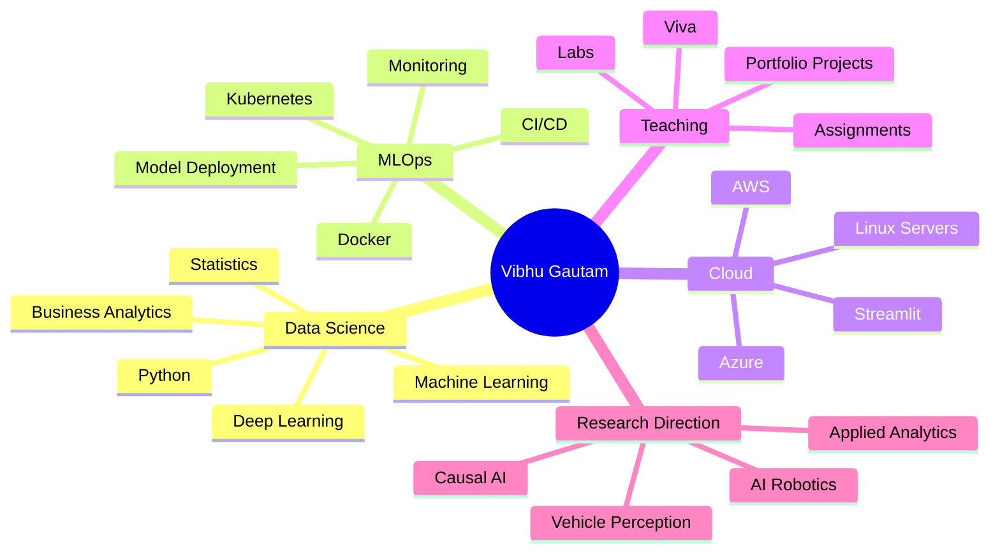

<!--
GitHub Profile README
Profile repository: vibhug0077/vibhug0077

Design note:
This version follows the portfolio-style palette:
Slate grey + electric blue + sky cyan + mint green.
The top banner is linked to: https://vibhug0077.github.io/vibhug0077/
-->

---

## 👋 About Me

I am **Vibhu Gautam**, a **Professor of Practice in Computer Science** focused on building practical, industry-aligned learning experiences in:

- **Data Science, Machine Learning, Deep Learning and Business Analytics**
- **DevOps, MLOps, Docker, Kubernetes and Cloud Model Deployment**
- **Python Programming, Linux Labs, Bash Automation and Applied AI**
- **Project-based teaching, hands-on labs and portfolio-ready student work**

My GitHub is a growing collection of course repositories, practical labs, notebooks, automation scripts, deployment examples and student-friendly technical resources.

---

## 🚀 Current Mission

<table>
<tr>
<td width="33%" valign="top">

### 🧠 Applied AI

Building learning resources around classical ML, deep learning, perception, analytics and model deployment.

</td>
<td width="33%" valign="top">

### ⚙️ MLOps + Cloud

Creating practical labs around Docker, Kubernetes, Linux, Streamlit, CI/CD and cloud deployment workflows.

</td>
<td width="33%" valign="top">

### 📚 Teaching Repositories

Designing clean repositories that students can use for labs, assignments, viva and portfolio development.

</td>
</tr>
</table>

---

## 🧰 Tech Stack

### Languages & Analytics

### Machine Learning & AI

### DevOps, MLOps & Cloud

---

## 📦 Featured Repositories

> Reliable Markdown/HTML cards are used instead of external repo-card images, so this section stays clean even when third-party image services are unavailable.

<table>
<tr>
<td width="50%" valign="top">

### 🐍 [Python Programming](https://github.com/vibhug0077/Python_Programing)

Python learning material, notebooks, programming fundamentals and practice examples.

</td>
<td width="50%" valign="top">

### 🐧 [Linux Lab](https://github.com/vibhug0077/Linux_Lab)

Linux commands, Bash scripting, permissions, automation and practical lab exercises.

</td>
</tr>

<tr>
<td width="50%" valign="top">

### 🐳 [Docker Containers](https://github.com/vibhug0077/Docker_Containers)

Docker labs, containerization examples, image creation, Compose and DevOps practice.

</td>
<td width="50%" valign="top">

### 📐 [Mathematics for Machine Learning](https://github.com/vibhug0077/Mathematics-for-Machine-Learning)

Mathematical foundations required for machine learning and data science.

</td>
</tr>

<tr>
<td width="50%" valign="top">

### 🤖 [Classical Machine Learning First Course](https://github.com/vibhug0077/Classical_Machine_Learning_First_Course)

Classical ML concepts, algorithms, examples and practical learning resources.

</td>
<td width="50%" valign="top">

### 🧩 [DSA Python Easy 21 Day](https://github.com/vibhug0077/DSA_Python_Easy_21Day)

A beginner-friendly Python DSA practice path for consistent problem-solving.

</td>
</tr>
</table>

---

## 🗺️ Repository Map

| Area | Repositories | What You Will Find |
|---|---|---|
| **Python + Programming** | [`Python_Programing`](https://github.com/vibhug0077/Python_Programing), [`DSA_Python_Easy_21Day`](https://github.com/vibhug0077/DSA_Python_Easy_21Day) | Python notebooks, programming practice, DSA foundations |
| **Machine Learning** | [`Classical_Machine_Learning_First_Course`](https://github.com/vibhug0077/Classical_Machine_Learning_First_Course), [`Mathematics-for-Machine-Learning`](https://github.com/vibhug0077/Mathematics-for-Machine-Learning) | ML concepts, math foundations, notebooks and examples |
| **Linux + Automation** | [`Linux_Lab`](https://github.com/vibhug0077/Linux_Lab) | Linux commands, shell scripting, lab practice and automation |
| **DevOps + Containers** | [`Docker_Containers`](https://github.com/vibhug0077/Docker_Containers) | Docker labs, containers and orchestration foundations |
| **Cloud + Portfolio** | [`Cloud_Computing_Book`](https://github.com/vibhug0077/Cloud_Computing_Book), [`vibhug0077`](https://github.com/vibhug0077/vibhug0077) | Cloud notes, GitHub profile and portfolio resources |

---

## 📊 GitHub Activity

---

## 🧪 Teaching + Project Themes

---

## 🧭 Learning Philosophy

> **Teach by building. Learn by shipping. Improve by documenting.**

I believe students learn best when concepts are connected to real systems.

That is why my repositories focus on:

- clean folder structure,
- practical lab execution,
- repeatable commands,
- readable scripts,
- viva-ready explanations,
- and portfolio-quality outcomes.

---

## 🔄 Dynamic Profile Section

<!--START:DYNAMIC_PROFILE-->
### Latest Profile Update

- **Last automated update:** 2026-07-06 13:17 IST
- **Current focus:** Data Science, Linux Labs, Docker, MLOps and Cloud Deployment
- **Active build mode:** Teaching repositories + practical project templates

### Recently Highlighted Repositories

| Repository | Focus |
|---|---|
| [`Python_Programing`](https://github.com/vibhug0077/Python_Programing) | Python notebooks and programming foundations |
| [`Linux_Lab`](https://github.com/vibhug0077/Linux_Lab) | Linux commands, Bash scripting and lab practice |
| [`Docker_Containers`](https://github.com/vibhug0077/Docker_Containers) | Docker, containers and DevOps labs |
| [`Mathematics-for-Machine-Learning`](https://github.com/vibhug0077/Mathematics-for-Machine-Learning) | Mathematics foundations for ML |
| [`Classical_Machine_Learning_First_Course`](https://github.com/vibhug0077/Classical_Machine_Learning_First_Course) | Classical ML concepts and examples |
| [`DSA_Python_Easy_21Day`](https://github.com/vibhug0077/DSA_Python_Easy_21Day) | Python DSA practice plan |
<!--END:DYNAMIC_PROFILE-->

---

## 🤝 Connect With Me

---

### ⭐ Thanks for visiting my GitHub profile

